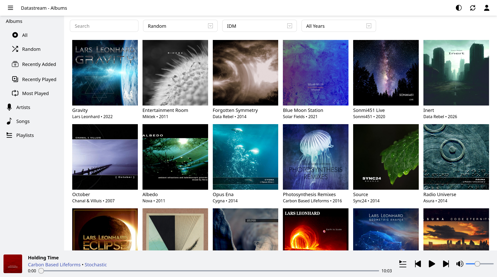
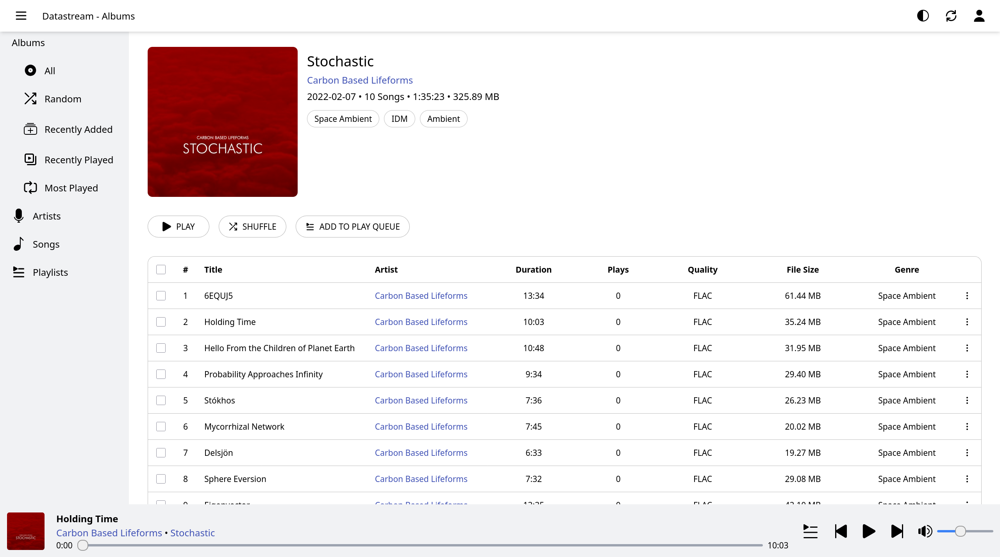

# Overview



Main features:

- Automatic music library scanning from a mounted host folder
- Browse and filter tracks, albums, and artists
- Playlist management (create, update, and organize tracks)
- JWT-based authentication with cookie support
- HTTP audio streaming endpoints
- Realtime scanner updates over WebSocket
- Persistent SQLite database storage via Docker volume
- One-command deployment with Docker Compose



This project runs as one application container:

- `datastream` (NestJS API + scanner + WebSocket + built Vite frontend)

## Installation

Create root `.env`:

```bash
JWT_SECRET=SUPER_SECRET_KEY
CLIENT_PORT=8080
MUSIC_HOST_PATH=./apps/server/temp-music-dir
COOKIE_SECURE=false
```

Use this `docker-compose.yml`:

```yaml
services:
  datastream:
    image: sneakyselderey/datastream:latest
    environment:
      JWT_SECRET: ${JWT_SECRET:-SUPER_SECRET_KEY}
      COOKIE_SECURE: ${COOKIE_SECURE:-false}
    ports:
      - "${CLIENT_PORT:-8080}:3000"
    volumes:
      - datastream_db:/data
      - ${MUSIC_HOST_PATH:-./apps/server/temp-music-dir}:/music:ro
    restart: unless-stopped
    networks:
      - datastream

networks:
  datastream:
    driver: bridge

volumes:
  datastream_db:
```

## Run

```bash
docker compose up -d
```

Open:

- `http://localhost:8080`

## Routing

- Browser calls `datastream` on port `8080`.
- NestJS handles API, media streaming, Swagger, WebSocket, and frontend file serving in the same container.
- `/api/*` routes are handled by backend controllers.
- `/stream/*` routes are handled by backend streaming endpoints.
- `/docs` serves Swagger/OpenAPI documentation.
- `/socket.io` is used by scanner progress WebSocket updates.
- Other browser page paths are served as SPA routes by the built frontend.

WebSocket path used by frontend:

- `/socket.io`

## Notes

- SQLite DB is persisted in the named volume `datastream_db`.
- Music library host path is configurable via `MUSIC_HOST_PATH` and is always mounted to fixed container path `/music`.
- Cover cache path is configurable via `COVERS_CACHE_PATH` (default: `/data/covers`).
- If you need HTTPS/HTTP/3, place an external reverse proxy in front later (Nginx/Caddy/Traefik/CDN).
- `apps/server/.env` is for non-Docker local backend runs only (`npm run start:dev` in `apps/server`).
